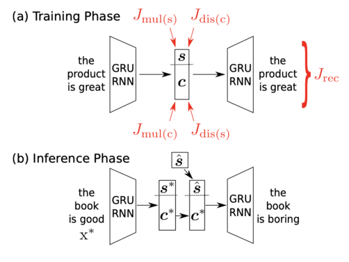

# Linguistic Style Transfer 
Implementation of the paper `Disentangled Representation Learning for Non-Parallel Text Style Transfer`[(link)](https://www.aclweb.org/anthology/P19-1041.pdf) in Pytorch

## Abstract
  This paper tackles the problem of disentangling the latent representations of style and content in language models.
  We propose a simple yet effective approach, which incorporates auxiliary multi-task and adversarial objectives, for 
  style prediction and bag-of-words prediction, respectively. We show, both qualitatively and quantitatively, that the 
  style and content are indeed disentangled in the latent space. This disentangled latent representation learning can be                  applied to style transfer on non-parallel corpora. We achieve high performance in terms of transfer accuracy, content     preservation, and language fluency, in comparision to various previous approaches.

To get a basic overview of the paper, read the [summary](summary.md).

## 1.Setup Instructions and Dependencies
You may setup the repository on your local machine by either downloading it or running the following line on `terminal`.

``` Batchfile
git clone https://github.com/h3lio5/linguistic-style-transfer-pytorch.git
```
All dependencies required by this repo can be downloaded by creating a virtual environment with Python 3.7 and running

``` Batchfile
python3 -m venv .env
source .env/bin/activate
pip install -r requirements.txt
pip install -e .
```
<strong> Note:</strong> Run all the commands from the root directory.      
## 2.Training Model from Scratch
To train your own model from scratch, run
```Batchfile
python train.py 
```     
+ The parameters for your experiment are all set by defualt. But you are free to set them on your own by editing the `config.py` file.
+ The training script will create a folder **checkpoints** as specified in your `config.py` file.
+ This folder will contain all model parameters saved after each epoch.

## 3. Transfering Text Style from Trained Models
To transfer text style of a sentence from trained models, run

```Batchfile
python generate.py 
```
The user will be prompted to enter the source sentence and the target style on running the above command:       
Example:           
``` Batchfile
Please enter the source sentence: the book is good
Please enter the target style: pos or neg: neg
Your style transfered sentence is: the book is boring
```
## 4.Repository Overview
This repository contains the following files and folders

1. **images**: Contains media for `readme.md`.

2. `linguistic-style-transfer-pytorch/data_loader.py`: Contains helper functions that load data.

3. `linguistic-style-transfer-pytorch/model.py`: Contains code to build the model.

4. `linguistic-style-transfer-pytorch/config.py`: Contains information about various file paths and model configuration.

5. `linguistic-style-transfer-pytorch/utils/vocab.py`: Contains code to build the vocabulary and word embeddings.

6. `linguistic-style-transfer-pytorch/utils/preprocess.py` Contains code to preprocess the data.

7. `linguistic-style-transfer-pytorch/utils/train_w2v.py`: Contains code to train word2vec embeddings from scratch on the downloaded data. 

8. `generate.py`: Used to generate and save images from trained models.

9. `train.py`: Contains code to train models from scratch.

10. `requirements.txt`: Lists dependencies for easy setup in virtual environments.


## 5.Training and Inference
Illustration of training and inference.    

## Resources
* Original paper `Disentangled Representation Learning for Non-Parallel Text Style Transfer` [(link)](https://www.aclweb.org/anthology/P19-1041.pdf)
* tensorflow implementation by the author [link](https://github.com/vineetjohn/linguistic-style-transfer)
